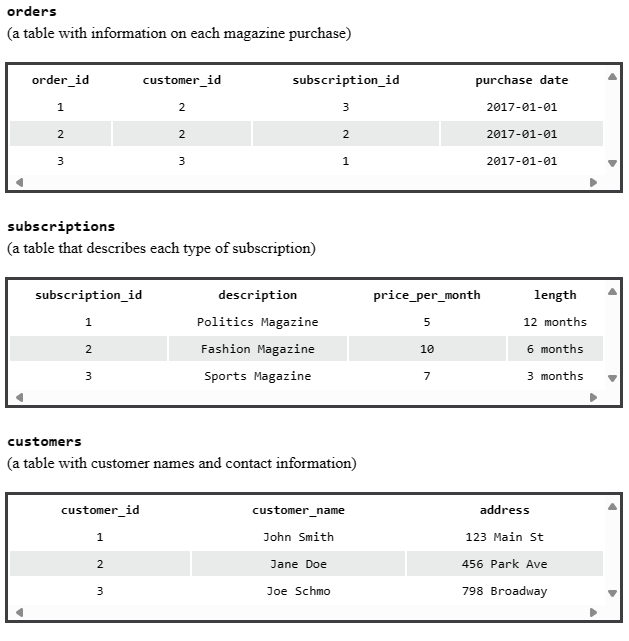

link to lesson:
https://www.codecademy.com/courses/learn-sql-multiple-tables/lessons/multiple-tables/exercises/what-is-join

MULTIPLE TABLES
Combining Tables Manually
5 min
Let’s return to our magazine company. Suppose we have the three tables described in the previous exercise – shown in the browser on the right (we are going to try something new!):

- orders
- subscriptions
- customers

If we just look at the orders table, we can’t really tell what’s happened in each order. However, if we refer to the other tables, we can get a complete picture.

Let’s examine the order with an order_id of 2. It was purchased by the customer with a customer_id of 2.

To find out the customer’s name, we look at the customers table and look for the item with a customer_id value of 2. We can see that Customer 2’s name is ‘Jane Doe’ and that she lives at ‘456 Park Ave’.

Doing this kind of matching is called joining two tables.

### Instructions
Checkpoint 1 Passed
1.Using the tables displayed, what is the description of the magazine ordered in order_id 1?

Type your answer on line 1 of the code editor.

Be sure to capitalize it the same as in the table.

First, we look at the orders table.

The order with an order_id of 1 is in the first row. Its subscription_id is 3.

Then we look at the subscriptions table.

The subscription with a subscription_id of 3 is in the third row. Its description is Sports Magazine.

Answer: Sports Magazine

Don’t write a query for this exercise!

2.Using the tables displayed, what is the customer_name of the customer in order_id 3?

Type your answer on line 2 of the code editor.

Be sure to capitalize it the same as in the table.

Answer: Joe Schmo
