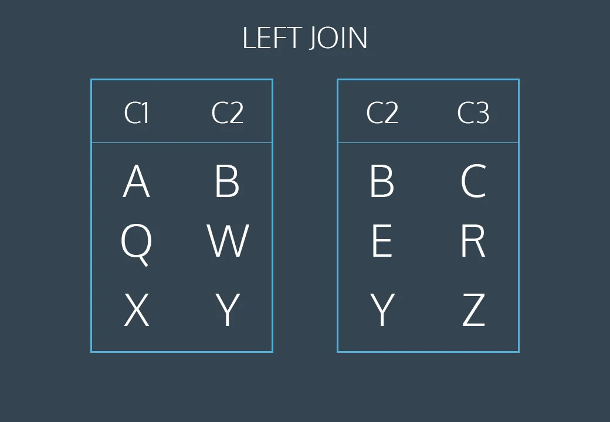

link

https://www.codecademy.com/courses/learn-sql-multiple-tables/lessons/multiple-tables/exercises/left-outer-join


MULTIPLE TABLES
Left Joins
8 min
What if we want to combine two tables and keep some of the un-matched rows?

SQL lets us do this through a command called LEFT JOIN. A left join will keep all rows from the first table, regardless of whether there is a matching row in the second table.

Consider the following animation:



The first and last rows have matching values of c2. The middle rows do not match. The final result will keep all rows of the first table but will omit the un-matched row from the second table.

This animation represents a table operation produced by the following command:

```
SELECT *
FROM table1
LEFT JOIN table2
  ON table1.c2 = table2.c2;

```

1. The first line selects all columns from both tables.
2. The second line selects table1 (the “left” table).
3. The third line performs a LEFT JOIN on table2 (the “right” table).
4. The fourth line tells SQL how to perform the join (by looking for matching values in column c2).
